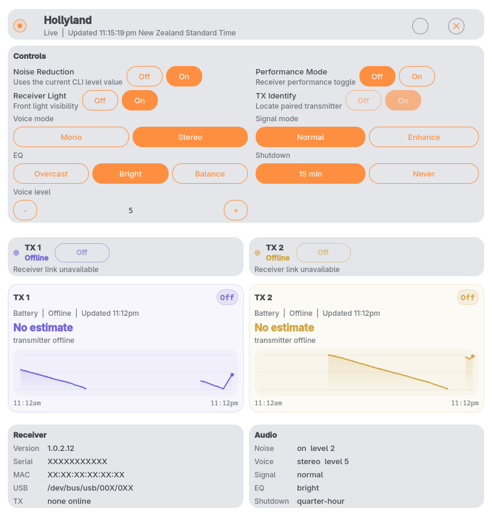

# Hollyland Noctalia Widget

A [Noctalia](https://github.com/noctalia) plugin that puts your Hollyland wireless receiver in the
status bar. A compact bar widget shows live transmitter state at a glance; clicking it opens a full
panel with receiver details, per-transmitter status, and controls for the most common audio settings.




The plugin works by polling a small local HTTP service (`service/hollyland-widget-service`) that
speaks directly to the Hollyland API over USB. To use the plugin you run that service once (or keep
it running as a user systemd unit), install the plugin into Noctalia, and the bar widget appears
automatically when a receiver is detected.

## What It Shows

- receiver presence and probe status
- RX version, serial, MAC, USB path
- transmitter online/offline state, battery, mute
- current audio settings from `summary`
- common write actions: noise, performance, light, identify, TX mute, voice mode, signal mode,
  EQ, shutdown time, and voice level

## Run The Service

The plugin expects the service on `127.0.0.1:8791` by default.

Run it directly:

```bash
./service/hollyland-widget-service
```

Or link/start the user unit:

```bash
systemctl --user link "$PWD/systemd/hollyland-widget.service"
systemctl --user enable --now hollyland-widget.service
systemctl --user status hollyland-widget.service
```

Useful overrides:

```bash
HOLLYLAND_WIDGET_HOST=127.0.0.1
HOLLYLAND_WIDGET_PORT=8791
```

Quick checks:

```bash
curl -s http://127.0.0.1:8791/health | python3 -m json.tool
curl -s http://127.0.0.1:8791/api/current | python3 -m json.tool
curl -s -X POST http://127.0.0.1:8791/api/action \
  -H 'content-type: application/json' \
  -d '{"action":"refresh"}' | python3 -m json.tool
python3 service/hollyland_api.py summary
```

## Install The Plugin

Install the QML into `~/.config/noctalia/plugins/hollyland/` and register it in
`~/.config/noctalia/plugins.json`:

```bash
./install.sh
```

Use `./install.sh --restart` to restart Noctalia after install, or `./install.sh --dry-run` to
inspect what would happen.

## Checks

Run the full local gate with:

```bash
scripts/check_all.sh
```

That runs:

- Python syntax compilation for `scripts/` and `service/`
- `bash -n install.sh`
- manifest and entry-point validation
- QML linting
- installer dry-run validation

QML linting expects a configured import shim. Set it up once per clone:

```bash
python3 scripts/setup_noctalia_qml_imports.py --checkout /etc/xdg/quickshell/noctalia-shell
```

## Regenerating Screenshots

```bash
python3 scripts/render_widget_screenshots.py
```

Requires the local service running on `127.0.0.1:8791` and Qt 6 `qmltestrunner` at
`/usr/lib/qt6/bin/qmltestrunner` (or `QML_TESTRUNNER` pointing at one). Receiver
identifiers in the panel are redacted by default; pass `--no-redact` for an
authentic local render.
